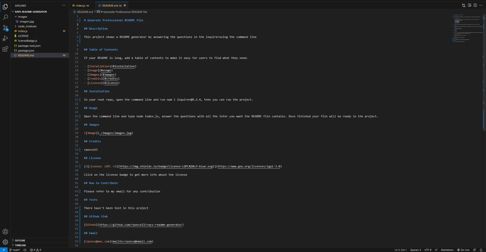

# rrrr

## Description

eeee

## Table of Contents

If your README is long, add a table of contents to make it easy for users to find what they need.

- [Installation](#installation)
- [Usage](#usage)
- [Images](#images)
- [Credits](#credits)
- [License](#license)

## Installation

rrrrr

## Usage

eeeee

## Images

## Credits

sss

## License

Click on the license badge to get more info about the license

## How to Contribute

ddd

## Tests

sss

## Github link

[Github](https://github.com/rponce23/rays-readme-generator)

## Email

[rponce@mac.com](mailto:rponce@hhh.com)

    